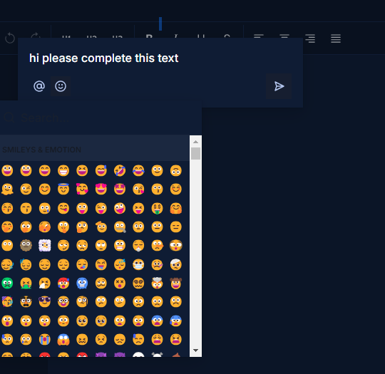

<h1 align="center">Welcome to Live Docs 👋</h1>
<p>
  
  <a href="https://twitter.com/Timmi_tech" target="_blank">
    
  </a>
</p>

> A collaborative text editor for you and your friends

### 🏠 [Homepage](https://live-docs-beta-khaki.vercel.app/)

## Install

```sh
npm run build
```

## Usage

```sh
npm run dev
```
## Navigating Around
<p>
   Enjoy navigating around the Page and feel free to add any documents
  
</p>

<p>
   Write live documents with other users
  
</p>

<p>
   Add Live comments with other users
  
</p>

<p>
   Select from thousands of emojis
  
</p>

<p>
   Share with other users
  
</p>

<p>
   Found a bug? Feel free to report
  
</p>


## PS
<p>Page done using Next.js + TailwindCSS</p>
<p>Other important components include shadcn, liveblocks, jsm editor, sentry & clerk</p>

## Author

👤 **Oluwole Daniel Oluwatimileyin**

* Website: https://timmi-tech.kesug.com/
* Twitter: [@Timmi\_tech](https://twitter.com/Timmi\_tech)
* Github: [@Tiimmii](https://github.com/Tiimmii)
* LinkedIn: [@tiimmii](https://linkedin.com/in/tiimmii)